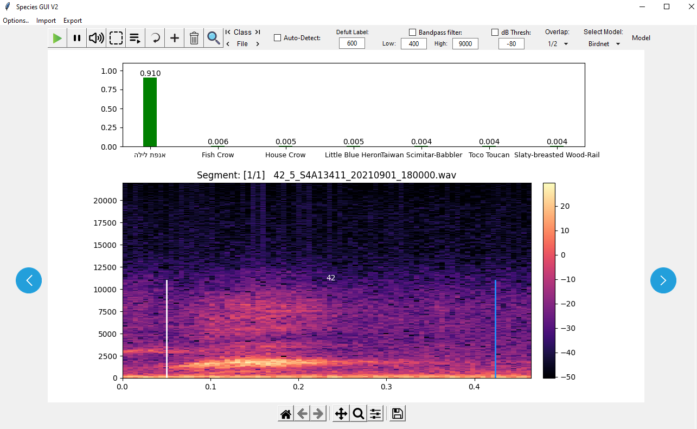
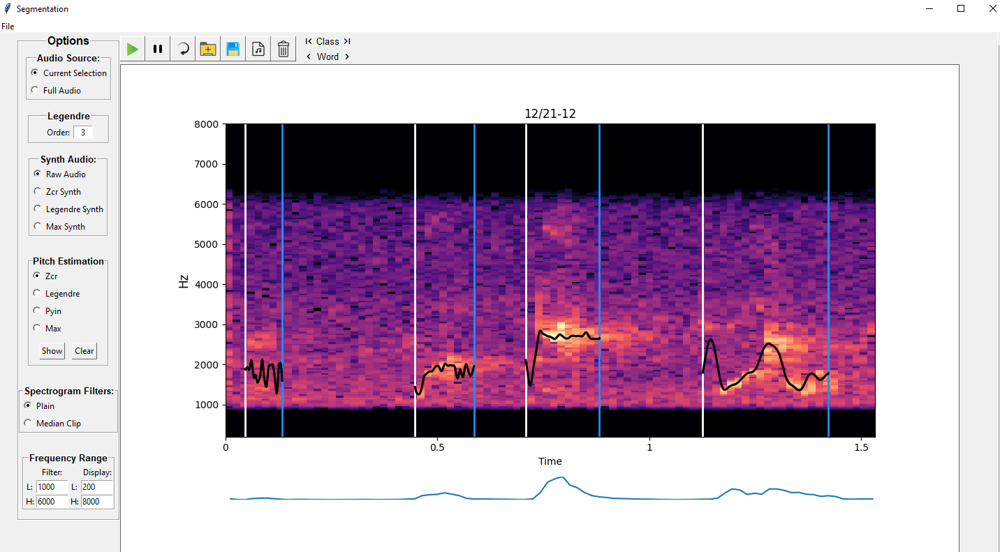

# Portfolio
This Repository contains some of my works and projects.
  

### 1.Birder
An audio analysis desktop application - predict, label and analyze bio-acoustic audio files.

Main features:
* Analyze long audio files segment by segment, with chosen overlap.
* Display a labeled in time with left and right markers, and a text label.
* Using a pre-loaded Tensorflow model, run inference on the current segment and display prediction results.
* Upload your own Tensorflow model.
* Display top prediction probabilities.
* Run prediction sequentially on long wave files, and produce a prediction report for each segment.
* Add or erase borders, as well as shift existing predicted borders interactively using the mouse.
* Edit segment's label using the keyboard.
* Easily select time and frequency range using the mouse, and play audio with/without bandpass filter.
* Import time-signatures from text files.
* Export wave files/time-signatures report by displayed borders.
* Zoom in/out
* Save displayed spectrogram as an image
  

 

### 2.Chirp Segmentation
Segment bird's chirp-words into syllables.
Optimized for the bird 'Bulbul', but can be adjusted to fit any vocalization.
The heart of the segmentation process relies on a novel segmentation algorithm i've formulated,
which is based on the use of Canny edge detection.

Main features:
* Segment given audio file into detected syllables and display borders.
* Calculate and draw pitch estimation using the following methods:
	* Zero-crossing rate
	* Fitting a Legendre polynomial of chosen order to Zcr pitch estimation
	* Pyin
	* Max frequency component for each time frame, extracted directly from the signal's STFT
* Synthesize and play audio using the pitch estimation methods mentioned above.
* Play and pause full audio, or detected regions only.
* Appply median-clipping to the displayed spectrogram.
* Apply a bandpass filter in selected range.
* Display signal's energy function.
* Export segmented wave files/time-signatures report.
* Export wave files/time-signatures report by displayed borders.
* Zoom in/out.
* Save displayed spectrogram as an image.
 
 

 
 

