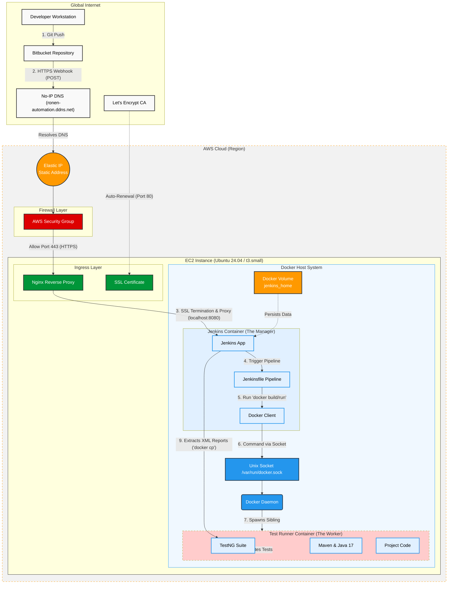

# Portfolio

# Portfolio
This Repository contains some of my work and projects:
##### 1. End-to-End CI/CD Infrastructure deployed on AWS
##### 2. Birder
##### 3. Chirp Segmentation

1. # End-to-End CI/CD Infrastructure deployed on AWS

* The **Maven/Java-Kotlin-TestNG stack** combines dependency/plugin management with suite definitions so each build compiles into a runnable JAR that feeds the pipeline shown above.
* A **Dockerized Jenkins** image based on Maven/OpenJDK copies the repository, exposes 8080, and runs `mvn test` for quick local validation before cloud deployment.
* The **AWS foundation** consists of an Ubuntu EC2 machine, Docker configured for a non-root user, an Elastic IP, and a No-IP DNS record that keeps `ronen-automation.ddns.net` tied to that static endpoint.
* ***Jenkins deployment** mounts a persistent `jenkins_home` volume and the host `/var/run/docker.sock` so Jenkins can launch docker-in-docker sibling workers that execute the automation code.
* **Networking and SSL** rely on AWS security groups that limit traffic to HTTP/HTTPS, while **Nginx** plus **Certbot/Let’s Encrypt** terminate SSL and redirect HTTP requests to HTTPS before reaching Jenkins.
# **Operational flow** mirrors the diagram: a Bitbucket webhook hits the DNS name, Nginx terminates SSL and proxies to Jenkins, and Jenkins rebuilds Docker images, runs TestNG suites, exports XML reports, and deletes the ephemeral worker containers.

Note: The EC2 host is currently disabled, and the automation code now lives in a dedicated Bitbucket repository; please reach out if you want to schedule a live demo.

  

### 2. Birder
An audio analysis desktop application - predict, label and analyze bio-acoustic audio files.

Main features:
* Analyze long audio files segment by segment, with chosen overlap.
* Display a labeled temporal-segment with left and right markers, and a text label.
* Using a pre-loaded Tensorflow model, run inference on the current segment and display prediction results.
* Upload your own Tensorflow model.
* Display top prediction probabilities.
* Run prediction sequentially on segments of long wave files, and produce prediction report.
* Add or erase borders, as well as shift existing predicted borders interactively using the mouse.
* Edit segment's label using the keyboard.
* Easily select time and frequency range using the mouse, and play audio with/without bandpass filter.
* Import time-signatures from text files.
* Export wave files/time-signatures report of displayed borders.
* Zoom in/out
* Save displayed spectrogram as an image
  

 

### 3. Chirp Segmentation
Segment bird's chirp-words into syllables.
Optimized for the bird 'Bulbul', but can be adjusted to fit any vocalization.
The heart of the segmentation process relies on a novel segmentation algorithm i have formulated,
which is based on the use of Canny edge detection.

Main features:
* Automatic temporal segmentation of provided audio file into unit events.
* Display detected borders with the ability of interactive editing.
* Calculate and draw pitch estimation using the following methods:
	* Zero-crossing rate
	* Fitting a Legendre polynomial of chosen order to Zcr pitch estimation
	* Pyin
	* Max frequency component for each time frame, extracted directly from the signal's STFT
* Synthesize and play audio using the pitch estimation methods mentioned above.
* Play and pause full audio, or detected regions only.
* Appply median-clipping to the displayed spectrogram.
* Apply a bandpass filter in selected range.
* Display signal's energy function.
* Export segmented wave files/time-signatures report.
* Export wave files/time-signatures report by displayed borders.
* Zoom in/out.
* Save displayed spectrogram as an image.

  

 
 

